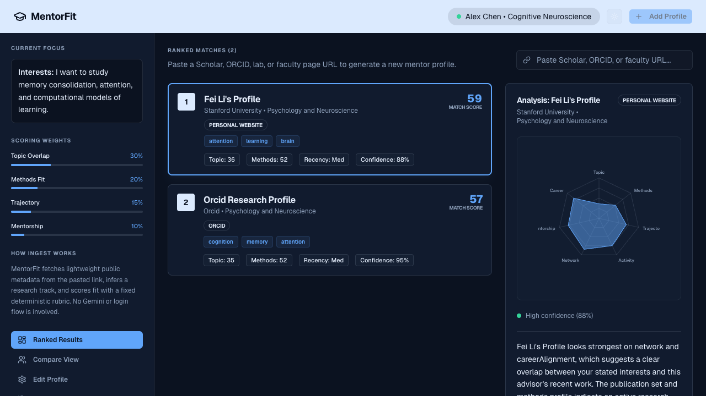

# MentorFit

MentorFit is a research mentor discovery and comparison app built to help students evaluate potential PhD advisors based on topic overlap, methods fit, trajectory, and mentorship signals.

## App Screenshots

### Landing Page

Current MVP landing experience with the product overview and onboarding entry point.

### Dashboard In Dark Mode

Ranked mentor matches, scoring breakdowns, and profile comparison flow in the app dashboard.

